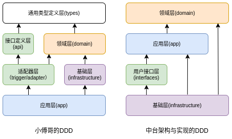

# DDD

参考（从入门到深入）：

+ [DDD专题-小傅哥](https://bugstack.cn/md/develop/framework/ddd/2019-10-15-DDD%E4%B8%93%E9%A2%98%E6%A1%88%E4%BE%8B%E4%B8%80%E3%80%8A%E5%88%9D%E8%AF%86%E9%A2%86%E5%9F%9F%E9%A9%B1%E5%8A%A8%E8%AE%BE%E8%AE%A1DDD%E8%90%BD%E5%9C%B0%E3%80%8B.html)

+ [DDD架构-小傅哥](https://bugstack.cn/md/road-map/ddd.html)

+ [MVC2DDD-架构重构](https://bugstack.cn/md/road-map/mvc2ddd.html)

+ [awesome-ddd](https://github.com/heynickc/awesome-ddd)

  包括一些书籍、课程、博客、示例项目。

+ 《中台架构与实现，基于DDD和微服务》C5-C11

  先看前面的网页资料，有个大概的认识，最好看看DDD示例代码的结构，然后看这本书会更容易。

  这本书最大的问题是没有提供完整的源码（只有第19章的一个简陋的案例），书上描述的DDD和小傅哥的DDD在分层结构和依赖关系上还是有一些出入的。

+ 《实现领域驱动设计》

+ 《领域驱动设计》

## 基本概念

+ **领域**

+ **子域**

+ 核心子域

+ 通用子域

+ 支撑子域

+ **限界上下文**

  定义领域边界，限定什么内容应该在这个领域模型中实现，什么不应该在这个模型中实现。

+ 通用语言

+ **事件风暴**

  穷举领域中的动作或事件，比如电商领域的商品下单（动作）、订单支付（动作）、订单已支付（事件）等。

  如《中台架构与实现》中表 6-1。

+ **实体**

  包含唯一标识符（比如各种ID），是业务形态的业务对象（BO），集多个业务属性、操作、或行为于一体，是一个属性集合。

  一个实体对象可能对应0、1或多个数据库持久化对象（PO）。

  比如：用户user和角色role两个持久化对象的属性（不要求所有属性）生成**权限实体**。

+ **值对象**

  本质也是一个属性集合，不过不包含唯一标识符；

  比如：一个人员Person 实体，包含用户ID、姓名、年龄、性别等 User 持久化对象的部分属性，还包括 省、市、区等 Address 持久化对象的部分属性，

  Person 类定义时常常会将上面的Address属性定义为一个值对象进行包含，而不是直接将Address的属性平铺到Person类中。

+ **聚合、聚合根**

  聚合是由业务和逻辑紧密关联的实体和值对象组合而成的；

  聚合属于领域层。

  聚合根是聚合中的实体，又称根实体，聚合根可以解决聚合中实体和值对象的之间的数据不一致的情况，怎么做？

+ **领域事件**

+ **领域服务**

+ **贫血模型**
+ **充血模型**

## 分层结构

架构分层规定项目的模块组成，领域分层决定领域服务内部软件包（如package）组成。

这里对比下小傅哥的DDD和《中台架构与实现，基于DDD和微服务》书上DDD的差异。

**架构分层**（小傅哥）：

- **接口定义 - xfg-frame-api**：因为微服务中引用的 RPC 需要对外提供接口的描述信息，也就是调用方在使用的时候，需要引入 Jar 包，让调用方好能依赖接口的定义做代理。

- **应用封装 - xfg-frame-app**：这是应用启动和配置的一层，如一些 aop 切面或者 config 配置，以及打包镜像都是在这一层处理。你可以把它理解为专门为了启动服务而存在的。

- **领域封装 - xfg-frame-domain**：领域模型服务，是一个非常重要的模块。无论怎么做DDD的分层架构，domain 都是肯定存在的。在一层中会有一个个细分的领域服务，在每个服务包中会有【模型、仓库、服务】这样3部分。

- **仓储服务 - xfg-frame-infrastructure**：基础层依赖于 domain 领域层，因为在 domain 层定义了仓储接口需要在基础层实现。这是依赖倒置的一种设计方式。

  > 依赖倒置：领域层需要调用基础层的的仓库接口，但是仓库接口API放在领域层中定义，实现基础层反过来依赖领域层。
  >
  > 像JDK中提供的一些 DataSource、Servlet API  都是依赖倒置。

- **领域封装 - xfg-frame-trigger**：触发器层，一般也被叫做 adapter 适配器层。用于提供接口实现、消息接收、任务执行等。所以对于这样的操作，小傅哥把它叫做触发器层。

- **类型定义 - xfg-frame-types**：通用类型定义层，在我们的系统开发中，会有很多类型的定义，包括；基本的 Response、Constants 和枚举。它会被其他的层进行引用使用。

- **领域编排【可选】 - xfg-frame-case**：领域编排层，一般对于较大且复杂的的项目，为了更好的防腐和提供通用的服务，一般会添加 case/application 层，用于对 domain 领域的逻辑进行封装组合处理。

**架构分层**（中台架构与实现）：

+ **用户接口层**

  借助 facade服务、数据组装器 Assembler 面向前端提供灵活的适配能力，保证应用层和领域层核心领域逻辑稳定；

  对应上面的**适配器层**；

+ **应用层**

  是很薄的一层，主要用于协调领域层多个聚合完成服务的组合和编排（通过提供应用服务的方式）；

  对应上面的 (**应用封装 + 领域编排**)；

  在应用层主要有应用服务、事件订阅和发布等相关逻辑代码；

  在应用服务中还可以进行**安全认证、权限校验、事务控制、领域事件的发布和订阅**；

  > 为了防止事务控制嵌套，领域层统一不加事务控制，事务控制全部放在应用层的应用服务中。

+ **领域层**

+ **基础层**

  主要用于为其他层提供通用的技术和基础服务，包括第三方工具、驱动、消息中间件、网关、文件、缓存以及数据库，最常用的功能是完成实体的数据库持久化。

  > 第三方工具放在基础层，领域层中要使用怎么办？
  >
  > 像小傅哥的DDD可以将第3方工具放入**通用类型定义层（types）**解决。

**分层之间的依赖关系**：

两者的领域层均处于核心依赖位置；

两者适配器层（用户接口层）、领域层的职能基本相同，应用层和基础层有较大差异；小傅哥的应用层包含了一些中间件的配置，即有中台架构与实现的DDD的基础层的部分职能；

小傅哥的DDD只有基础层和领域层使用了依赖倒置；中台架构与实现的DDD基础层和领域层、基础层和应用层、用户接口层和应用层都使用了依赖倒置（根据书上图17-1微服务的服务调用关系推测）；

> 不明白中台架构与实现中为何将基础层作为最重的一层？个人感觉小傅哥的分层依赖关系更合理，也更符合直觉。

**领域分层**：

介绍 domain 模块的分包和工作流程。

## 分层中的各种对象类型的转换

